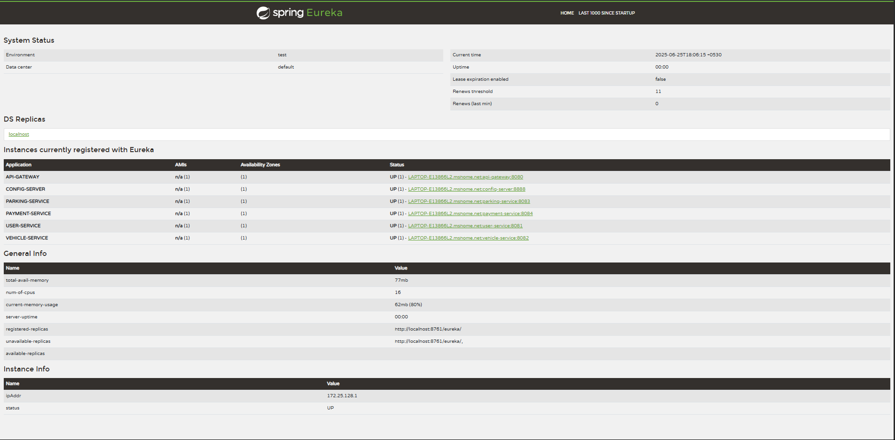

# 🚗 Parking Reservation System

A **microservice-based parking management solution** designed for modern urban environments.

---

## 🏗️ Architecture Overview

- ✅ **Spring Boot Microservices**
- ✅ **Eureka Service Discovery**
- ✅ **Spring Cloud Config**
- ✅ **API Gateway**

---

## 🧩 Microservices

1. **User Service** – Manages user accounts and authentication
2. **Parking Service** – Manages available parking spaces
3. **Vehicle Service** – Handles vehicle registration and data
4. **Payment Service** – Processes user payments securely

---

## 📂 Resources

- 📫 **Postman Collection**:  
  [SPMS Testing Postman Collection](./docs/JSON/SPMS%20Testing.postman_collection.json)

- 📊 **Eureka Dashboard Screenshot**:  
  

---

## 🔗 Repository

For complete source code and documentation, visit the GitHub repository:  
👉 [https://github.com/pasindipamodagamage/Parking-Reservation-System-Final.git](https://github.com/pasindipamodagamage/Parking-Reservation-System-Final.git)

---
